# imgclr

`imgclr` modifies images to fit a given colour palette.

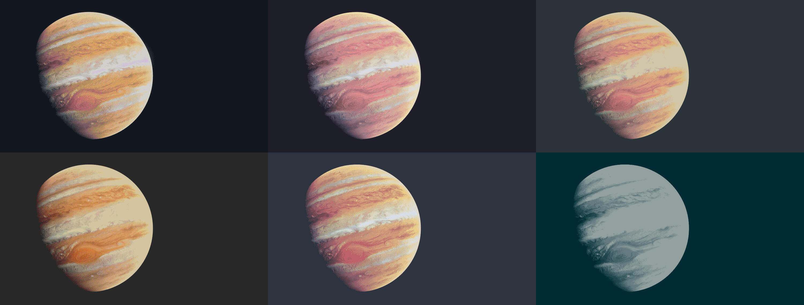

Dual-licensed under [GPL-3.0](./LICENSE-GPL3) or [MIT](./LICENSE-MIT). To get `imgclr`,
[download the latest release](https://github.com/felix-u/imgclr/releases) or follow the
[compilation instructions](#building).

### Summary

`imgclr`:

- Changes the palette of images
- Supports JPG and PNG (as well as others)
- Uses dithering for smoother results
- Enables the inversion of image brightness levels (converting dark images to light and vice versa)


### Examples

Input                                                | Result (dithered)
:---------------------------------------------------:|:---------------------------------------------------------------------:
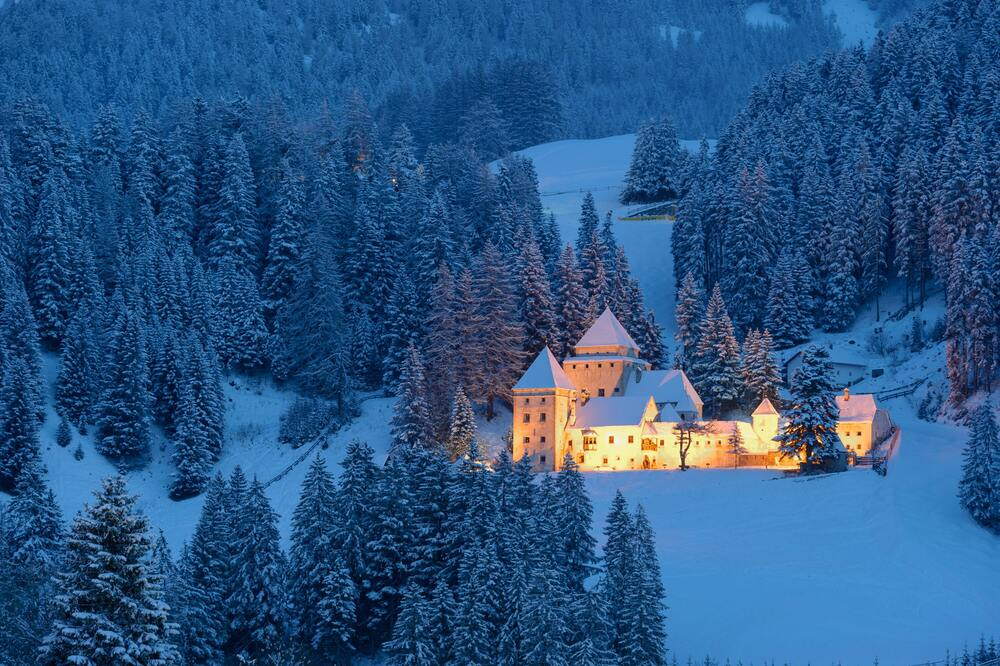 | 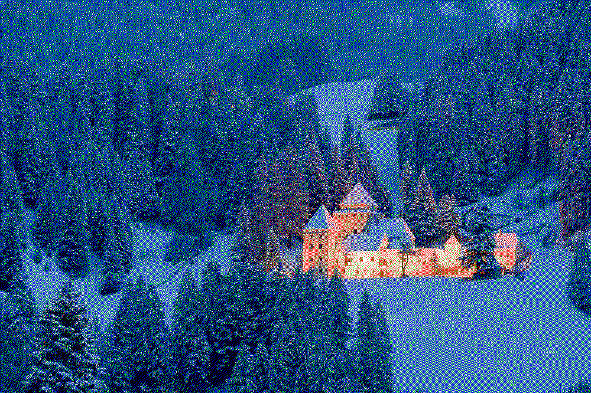

#### Dithering

You'll notice that the output looks suspiciously similar to the input, and perhaps slightly grainy. This is because
`imgclr` uses [Floyd-Steinberg dithering](https://en.wikipedia.org/wiki/Floyd%E2%80%93Steinberg_dithering) to smoothen
the output, making it seem as if there is more colour fidelity than there really is. With dithering, a dark purple
colour in the input image may be approximated using your supplied blue, red, and black, even if you specified no
purple. This works due to the same effect that makes a red and white striped shirt appear pink from a distance.

Input                                                | Result (simple): each pixel either black or white                               | Result (dithered): each pixel either black or white
:---------------------------------------------------:|:-------------------------------------------------------------------------------:|:-------------------------------------------------------------------------:
 | 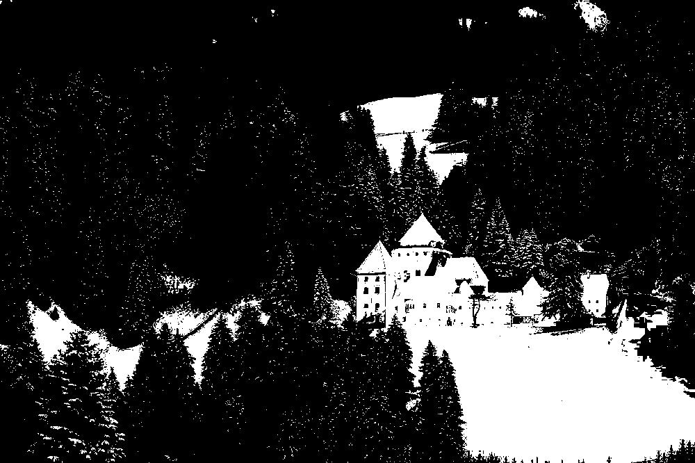 | 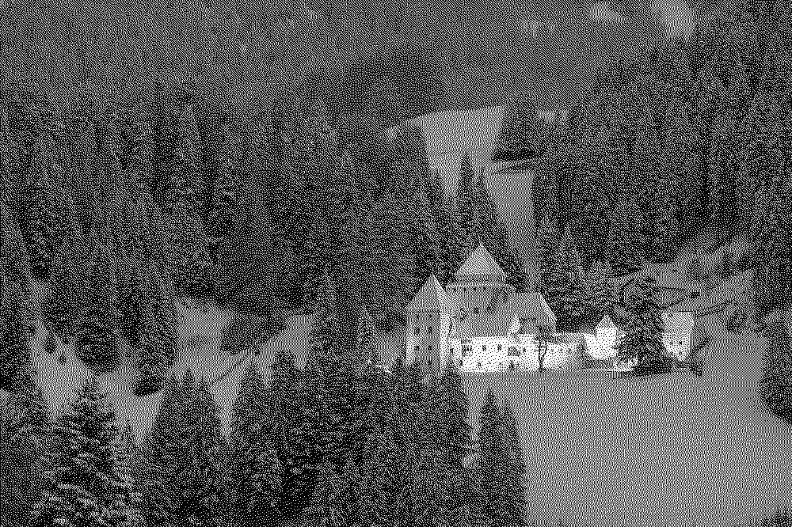

With dithering disabled, `imgclr` simply goes through each pixel, choosing the closest match from your input palette.
Let's retry our example in colour, this time disabling dithering by passing `--dither/-d none`:
```sh
imgclr -i input.jpg -o output.jpg -p 000 fff f00 0f0 00f --dither none
```
Input                                                | Result (simple)
:---------------------------------------------------:|:---------------------------------------------------------------------------:
 | 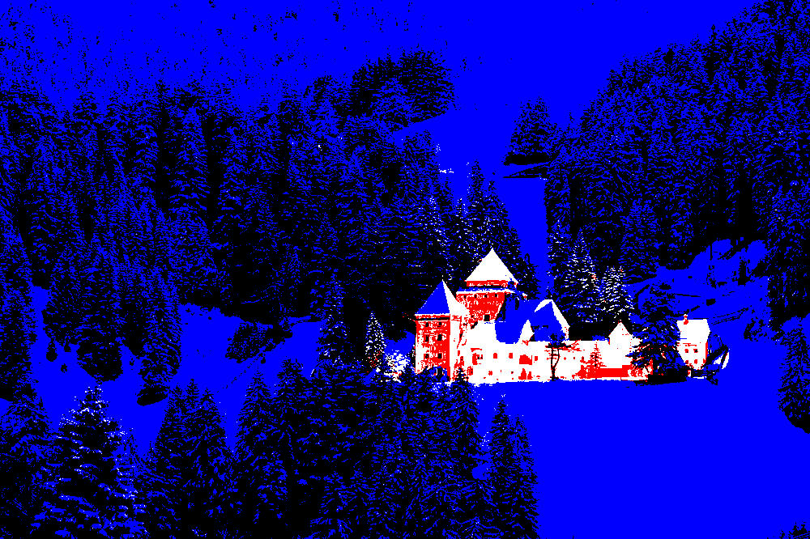

Dithering is enabled by default due to its great improvement of results and low impact on speed (50% or less).  For
more abstract or cartoonish images, disabling dithering or using the "Atkinson" algorithm will generally yield
better-looking results. You could experiment with the other algorithms to find your favourite.

#### Dithering algorithms

Multiple dithering algorithms are supported by `imgclr`. The best way to decide on an algorithm is to just *try them!*
But if that's not enough for you, below are descriptions of each algorithm, including example images. The "baseline"
speed comparisons compares to running imgclr with dithering disabled and are approximations.

* **Floyd-Steinberg** (`-d floyd-steinberg`) - 25% slower than baseline
    - Floyd-Steinberg dithering is common in a variety of use cases, popular for its balance of quality and speed. It is
   the default for this reason.
   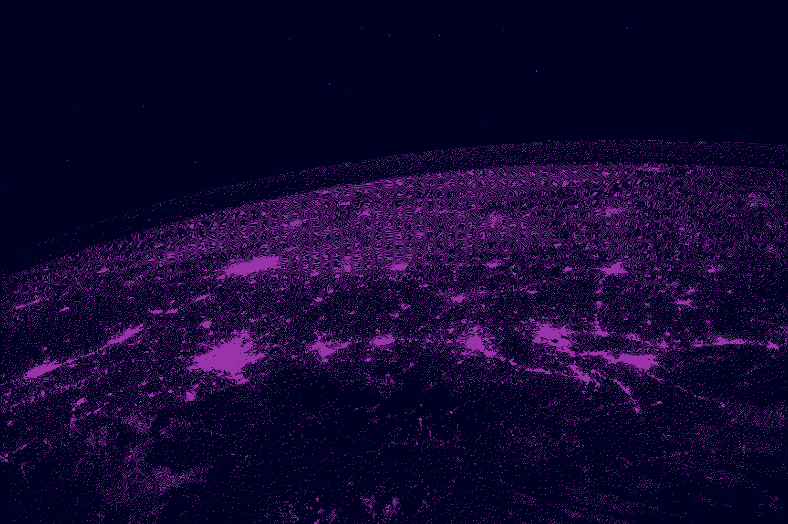

* **Atkinson** (`-d atkinson`) - 35% slower than baseline
    - Developed for Apple in the 90s, Atkinson dithering propagates only some of the quantisation error, resulting in a
   more contrasty look which better suits simpler or more abstract images.
   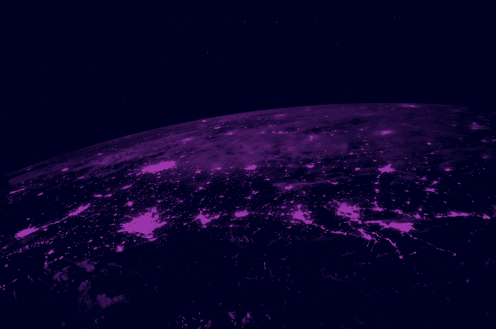

* **Jarvis-Judice-Ninke** (`-d jjn`) - 80% slower than baseline
    - Optimised for quality, and the slowest in the list.
   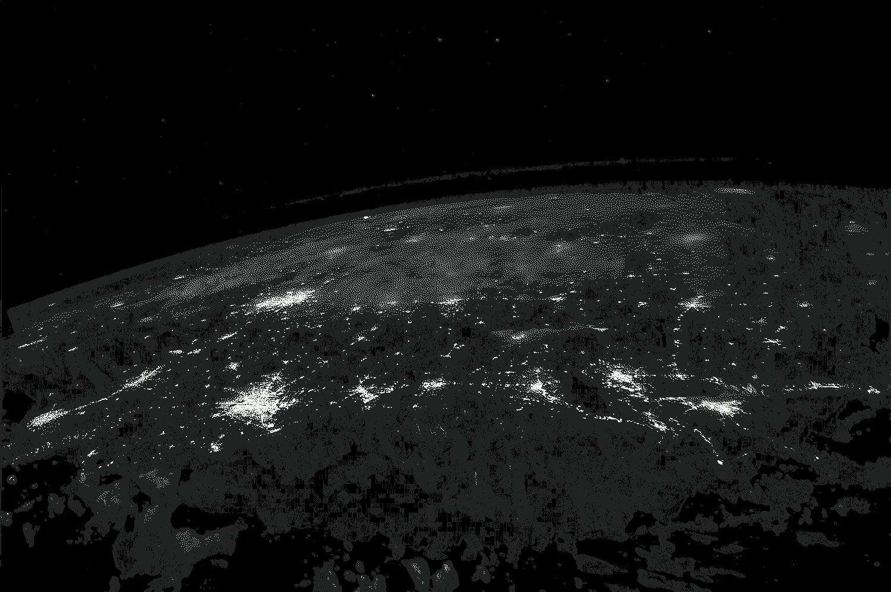

* **Burkes** (`-d burkes`) - 40% slower than baseline
    - Essentially a faster version of Jarvis-Judice-Ninke which achieves approximately the same look.
   

* **Sierra Lite** (`-d sierra-lite`) - 20% slower than baseline
    - Faster approximation of Floyd-Steinberg dithering.
   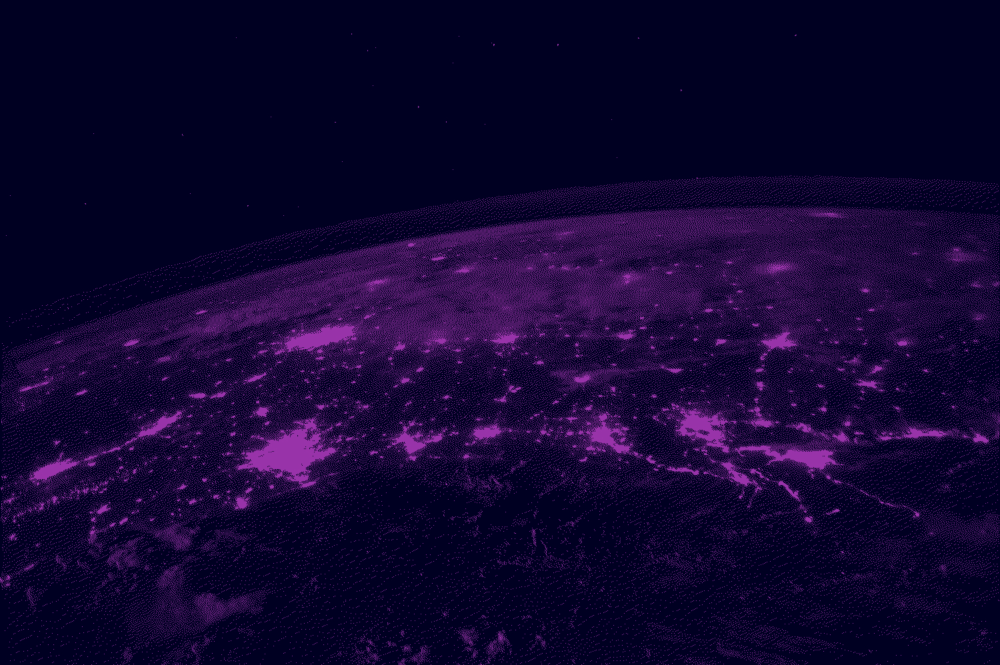

* **DITHERING DISABLED** (`-d none`) - baseline
  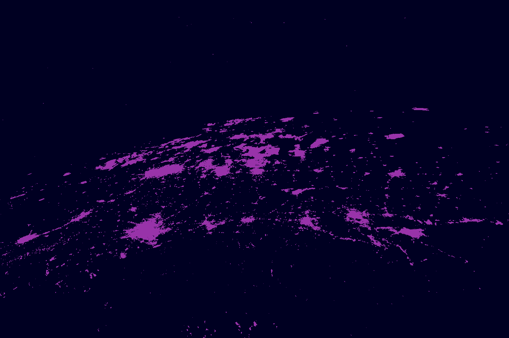

#### Inverting brightness

The `-s` or `--swap` flag inverts luminance whilst preserving hue and saturation. For example, perfect grey will remain
the same, black will become white, white will become black, and dark green will become light green. This inverted
version of your input image is what will be processed to generate the output image. Here's an example using the
[tokyonight](https://github.com/folke/tokyonight.nvim) colour scheme:

Input                                                   | Processed normally (no dithering)                       | Processed after luma inversion (no dithering)
:------------------------------------------------------:|:-------------------------------------------------------:|:--------------------------------------------------------------------------:
 |  | 

Notice that the bottom-most line keeps its colour. Usually, red would invert to green, and purple to yellow.

#### Using Xresources

You may wish to automatically pass in your Xresources theme colours. The `xres.sh` script is included for this very
purpose: at the top of the script, just set the path to your Xresources file (by default `~/.Xresources`) and the
path to the `imgclr` binary (by default `./imgclr`), and run the script, passing in the
same arguments you would use with `imgclr`. The script simply *parses* a file in the Xresources format, which means
it'll also work on Wayland, in the TTY, or on any operating system with a shell that can run it.


### Usage
```
imgclr <OPTION>... <FILE>...
Options marked with '*' are mandatory.

OPTIONS:
  -d, --dither <STR>
	specify dithering algorithm, or 'none' to disable. Default
	is 'floyd-steinberg'. Other options are: 'atkinson', 'jjn',
	'burkes', and 'sierra-lite'
* -p, --palette <STR>...
	supply palette as whitespace-separated hex colours
  -s, --swap
	invert image brightness, preserving hue and saturation
  -h, --help
	display this help and exit
      --version
	output version information and exit
```


### Building

These dependencies are likely already present on any UNIX-like OS:

- `git`
- a C99 compiler, such as `gcc` or `clang`
- a `make` implementation, such as `gnumake`

Using `git`, clone the source code and navigate to the desired release, where `X.X` is the version number. Building
from the `master` branch is highly discouraged.
```sh
$ git clone https://github.com/felix-u/imgclr
$ git checkout vX.X
```

To compile an optimised binary at `./imgclr` relative to this repository's root directory, run:
```sh
$ make release
```

To compile this binary *and* copy it to `~/.local/bin`, run:
```sh
$ make install
```


### Licence

imgclr is licensed under the terms of the MIT License, or alternatively under the terms of the General Public License
(GPL) Version 3. You may use imgclr according to either of these licences as is most appropriate for your project on a
case-by-case basis.

The terms of each licence can be found in the root directory of the imgclr source repository:

- MIT Licence: [LICENSE-MIT](./LICENSE-MIT)
- GPL3 Licence: [LICENSE-GPL3](./LICENSE-GPL3)

`SPDX-License-Identifier: MIT OR GPL-3.0-or-later`
