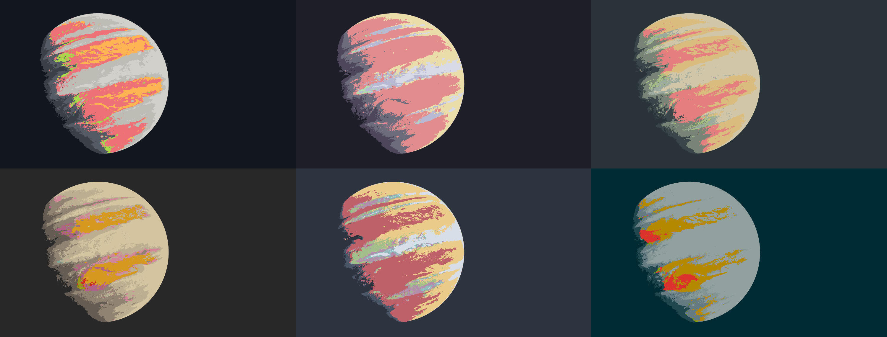

# imgclr

`imgclr` modifies images to fit a given colour palette.



### Features
- [x] Change palette of images
- [x] Support JPG, PNG, and a variety of popular lossy and lossless image formats (full list below)
- [x] Use dithering to generate smoother results
- [x] Allow the inversion of image brightness levels (convert dark images to light and vice versa)


### Building

First, [install rust and cargo](https://doc.rust-lang.org/cargo/getting-started/installation.html). Then, compile
`imgclr` by running `cargo build --release` in the project directory. The compiled binary will be at
`target/release/imgclr`.


### Usage

```
USAGE:
    imgclr [OPTIONS] --input <input file> --output <output file> --palette <palette>...

OPTIONS:
    -h, --help                    Print help information
    -i, --input <input file>      Supply path to input file
    -n, --no-dither               Disable Floyd-Steinberg dithering
    -o, --output <output file>    Supply path to output file
    -p, --palette <palette>...    Supply palette as whitespace-separated colours
    -s, --swap                    Invert image brightness, preserving hue and saturation
```
Note that the `-i`/`--input` and `-o`/`--output` arguments are **required**.

`imgclr` uses the [image](https://docs.rs/image/latest/image/) crate, which supports the most popular image formats,
including JPG and PNG. A full list of supported formats is in the [`image` README](https://github.com/image-rs/image).

Palette colours are supplied with the `-p` or `--palette` flag. Depending on your shell, they may have to be
quoted. The following are a few possible ways to represent perfect red:
* `rgb(255, 0, 0)`
* `hsl(0, 100%, 50%)`
* `#ff0000`
* `f00`

Here's what an `imglcr` command using black, white, red, green, and blue might look like, using a mix of these formats:
```sh
imgclr -i input.jpg -o output.jpg -p 000 fff "hsl(0, 100%, 50%)" "rgb(0, 255, 0)" 0000ff
```

Input                                                | Result (dithered)
:---------------------------------------------------:|:--------------------------------------------------:
 | 

#### Dithering

You'll notice that the output looks suspiciously similar to the input, and perhaps slightly grainy. This is because 
`imgclr` uses [Floyd-Steinberg dithering](https://en.wikipedia.org/wiki/Floyd%E2%80%93Steinberg_dithering) to smoothen
the output, making it seem as if there is more colour fidelity than there really is. With dithering, a dark purple
colour in the input image may be approximated using your supplied blue, red, and black, even if you specified no
purple. This works due to the same effect that makes a red and white striped shirt appear pink from a distance.

With dithering disabled, `imgclr` simply goes through each pixel, choosing the closest match from your input palette.
Let's retry our previous example, disabling dithering with the `-n`/`--no-dither` flag:

```sh
imgclr -i input.jpg -o output.jpg -p 000 fff "hsl(0, 100%, 50%)" "rgb(0, 255, 0)" 0000ff --no-dither
```

Input                                                | Result (simple)
:---------------------------------------------------:|:--------------------------------------------------:
 | 

Dithering is enabled by default due to its great improvement of results and low impact on speed (50% or less).  For
more abstract or cartoonish images, disabling dithering will generally yield better-looking results.

#### Inverting brightness

The `-s` or `--swap` flag inverts luminance whilst preserving hue and saturation. For example, perfect grey will remain
the same, black will become white, white will become black, and dark green will become light green. This inverted
version of your input image is what will be processed to generate the output image. Here's an example using the
[tokyonight](https://github.com/folke/tokyonight.nvim) colour scheme:

Input                                                   | Processed regularly                                     | Processed after luma inversion
:------------------------------------------------------:|:-------------------------------------------------------:|:--------------------------------------------------------------------------:
 |  | 

Notice that the bottom-most line keeps its colour. Usually, red would invert to green, and purple to yellow.

#### Using Xresources

You may wish to automatically pass in your Xresources theme colours. The `xres.sh` script is included for this very
purpose: at the top of the script, just set the path to your Xresources file (by default `~/.Xresources`) and the
path to the `imgclr` binary (by default `target/release/imgclr`), and run the script, passing in the
same arguments you would use with `imgclr`. The script simply *parses* a file in the Xresources format, which means
it'll also work on Wayland, in the TTY, or on any operating system with a shell that can run it.
