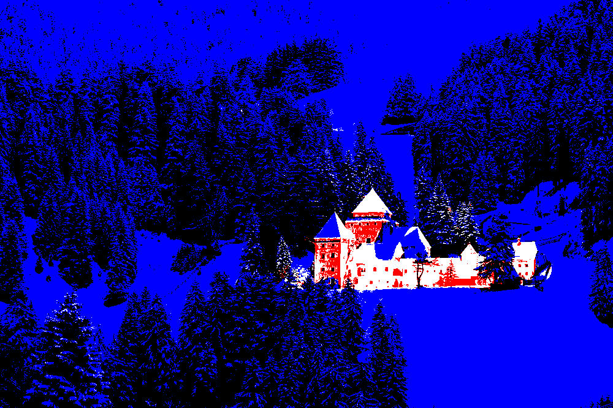

# imgclr

`imgclr` modifies images to fit a given colour palette.


### Features
- [x] Change palette of images
- [x] Work on JPG, PNG, and a variety of other image formats (see full ordered list below)
- [ ] Use dithering to generate smoother results
- [x] Allow the inversion of image brightness levels (convert dark images to light and vice versa)


### Building

First, [install rust and cargo](https://doc.rust-lang.org/cargo/getting-started/installation.html). Then, compile
`imgclr` by running `cargo build --release` in the project directory. The compiled binary will be at
`target/release/imgclr`.


### Usage

```
USAGE:
    imgclr [OPTIONS] --input <input file> --output <output file> --palette <palette>...

OPTIONS:
    -h, --help                    Print help information
    -i, --input <input file>      Supply path to input file
    -o, --output <output file>    Supply path to output file
    -p, --palette <palette>...    Supply palette as whitespace-separated hex values
    -s, --swap                    Invert image brightness, preserving hue and saturation
```
Note that the `-i` and `-o` arguments are **required**.

`imgclr` uses the [image](https://docs.rs/image/latest/image/) crate, which supports the most popular image formats,
including JPG and PNG. A full list of supported formats is in the [`image` README](https://github.com/image-rs/image).

Palette colours are supplied with the `-p` or `--palette` flag. Depending on your shell, they may have to be
quoted. The following are a few possible ways to represent perfect red:
* `rgb(255, 0, 0)`
* `hsl(0, 100%, 50%)`
* `#ff0000`
* `f00`

Here's what an `imglcr` command using black, white, red, green, and blue might look like, using a mix of these formats:
```sh
imgclr -i input.jpg -o output.jpg -p 000 fff "hsl(0, 100%, 50%)" "rgb(0, 255, 0)" 0000ff
```

Input                                                | Result
:---------------------------------------------------:|:--------------------------------------------------:
 | 

The `-s` or `--swap` flag inverts luminance whilst preserving hue and saturation. For example, perfect grey will remain
the same, black will become white, white will become black, and dark green will become light green. This inverted
version of your input image is what will be processed to generate the output image. Here's an example using the
[tokyonight](https://github.com/folke/tokyonight.nvim) colour scheme:

Input                                                   | Processed regularly                                     | Processed after luma inversion
:------------------------------------------------------:|:-------------------------------------------------------:|:--------------------------------------------------------------------------:
 |  | 

#### Using Xresources

You may wish to automatically pass in your Xresources theme colours. The `xres.sh` script is included for this very
purpose: at the top of the script, just set the path to your Xresources file (by default `~/.Xresources`) and the
path to the `imgclr` binary (by default `target/release/imgclr`), and run the script, passing in the
same arguments you would use with `imgclr`. The script simply *parses* a file in the Xresources format, which means
it'll also work on Wayland, in the TTY, or on any operating system with a shell that can run it.
